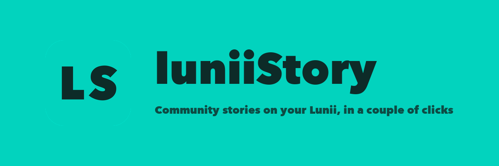
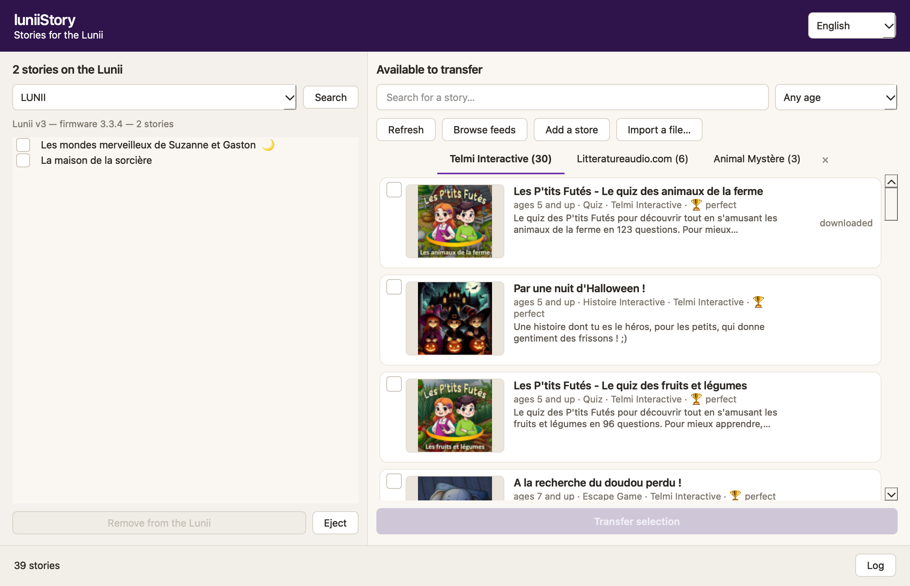
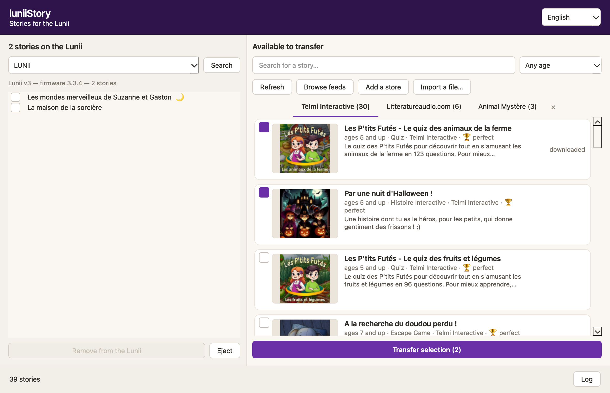
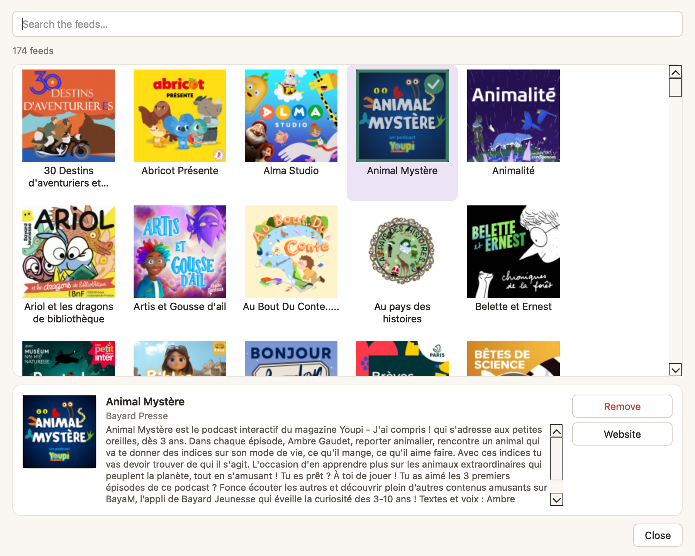

<div align="center">


# luniiStory

Put community stories on a Lunii, from Windows, macOS and Linux.


[](https://github.com/nicotontige/LuniiStory/stargazers)

[](https://github.com/nicotontige/LuniiStory/fork)

[](https://github.com/nicotontige/LuniiStory/releases)

[](https://github.com/nicotontige/LuniiStory/releases)

[](LICENSE)


---

<a href="https://buymeacoffee.com/nicotontige" target="_blank" title="Buy me a coffee">
  
</a>

---

## Features


<center>

Browse community story libraries and transfer in one click <br/>
A published list of 170+ children's story libraries, nothing to hunt for <br/>
Your Lunii on the left, everything transferable on the right <br/>
Add any catalog or podcast address as a library of your own <br/>
Filter by the age a story is meant for, search across every library <br/>
Podcast episodes wrapped into a real pack, cover art and spoken title included <br/>
Nothing else to install: no FFMPEG, no Python, no toolchain <br/>
Eject the device so a transfer is never cut short <br/>
English and French <br/>
Works with Lunii v1, v2 and v3 <br/>
Tells you when a newer release is out <br/>
No account, no tracking, no ads <br/>

</center>


---

## Screenshots

|  |  |  |
|---|---|---|


---

## Download


[](https://github.com/nicotontige/LuniiStory/releases/latest)

Nothing to install: Python, Qt and the Lunii engine are inside. The builds are
unsigned, so macOS quarantines them on first launch:

```bash
xattr -dr com.apple.quarantine /Applications/luniiStory.app
```


---

## Contributors

Special thanks to all contributors for their time and effort.

<a href="https://github.com/nicotontige/LuniiStory/graphs/contributors">
  
</a>


---

## Contribute

Contributions are always welcome. Please read the
[contributing guidelines](CONTRIBUTING.md) before contributing — they also cover
running the application from source, how the conversion works, and how a release
is cut.

---

## F.A.Q

**Why can a story not be exported back off my Lunii?**
Exporting official stories is disabled upstream in Lunii.QT, and that limit is
kept here. luniiStory only writes to the device.

**My Lunii is plugged in and nothing shows up.**
Switch the device on: unplugged from power it enumerates over USB and mounts
nothing. If it is already on, the cable may be charge-only. The application says
which of the two it is.

**Why is a podcast episode marked differently?**
It is a bare MP3, with no cover and no spoken title, so a pack is built around
it before the transfer: the feed artwork becomes the image the Lunii shows, and
the title is spoken by the host's own voice.

**Which devices work?**
Lunii v1 and v2 are fully supported. v3 works for transfers; exporting from it
needs device keys in `~/.lunii-qt/<serial>.keys`. Flam is not exposed.


---

## Credits


[Lunii.QT](https://github.com/o-daneel/Lunii.QT) — the engine that talks to the
device, vendored as a submodule. Everything on the hardware side is its work.

[Telmi](https://github.com/DantSu/Telmi-Sync) — the pack format the community
publishes in, the libraries shipped by default, and the published list of them.

[STUdio](https://github.com/DantSu/studio) — the story format a Lunii reads,
and what every pack is converted into on the way through.


---

## License


```unknown
Copyright © 2026 nicotontige

luniiStory is free software licensed under GPL v3.0. You may use, modify, and
distribute this software freely, but must keep the source code open and publicly
available, retain all copyright notices, disclose all changes made, and use the
same GPL v3.0 license.

The licence is inherited from Lunii.QT, whose engine this project builds on.
```


See the [GNU General Public License](LICENSE) for full details.

---

## Disclaimer


```unknown
luniiStory does not host, own, or distribute any story, audio file, or artwork.
It follows the public catalogs you point it at, and transfers to your own device
the stories their authors chose to make available. All trademarks, stories, audio
files, and related content remain the property of their respective owners.

Lunii is a trademark of its owner. This project is not affiliated with, endorsed
by, or supported by Lunii. It reads and writes a device you own, which is what
interoperability means, and is provided for that purpose only.

Users are solely responsible for ensuring that their use complies with local law
and with the terms of the content they transfer.
```

---

</div>
